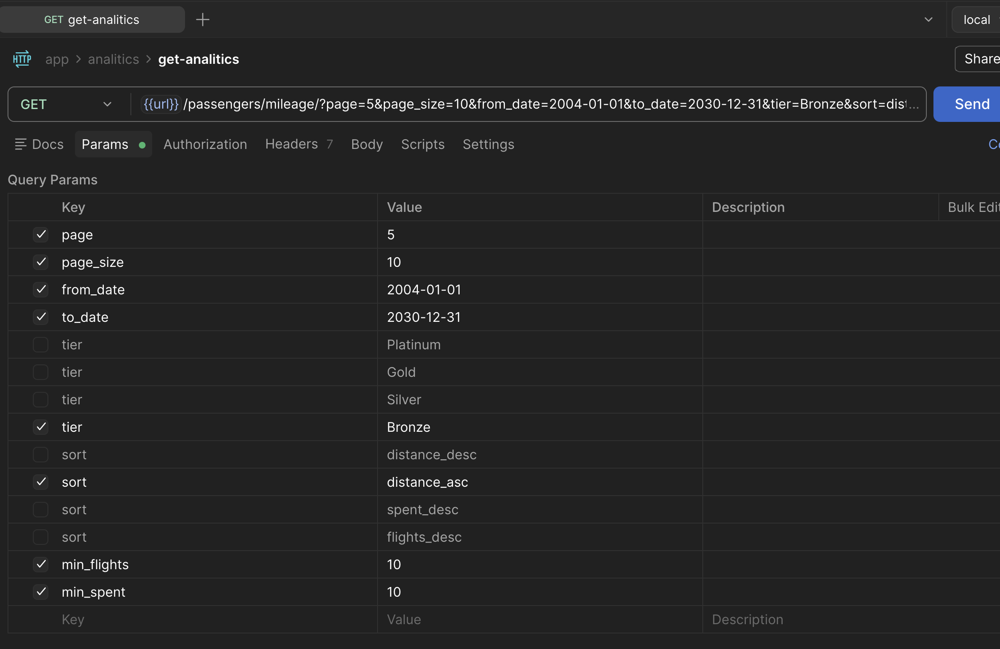

# passanger-millage-task
Aviocompany statistics api

Loyihaning assosiy maqsadi:
Aviakompaniyamiz loyalty (sodiqlik) dasturi va moliyaviy hisob uchun yo'lovchilar haqida
statistika qaytaruvchi REST API kerak. Endpoint har bir yo'lovchining:
● Uchgan masofasi va loyalty tier
● Jami xarajatlari
● O'rtacha, eng qimmat va eng arzon segment narxlari
barcha qismlarini oson ishlatiladi.


Loyihani ishga tushurish.

yuklab olish
```
1. git clone https://github.com/Ziyodullodev/passanger-millage-task.git
1.1. cd passanger-millage-task/
```

env fayl yaratish
```
2. cp .env.example .env

```


loyihani docker composeni ishga tushurish
```
3. docker compose up --build

```

avvalo 1.1 gb backup faylni postgresql docker containerga yuklash kerak.
```
copy qilib olamiz.
4.1. docker cp <path>/passanger-millage-task/demo-20250901-2y.sql.gz <container_id>:/

container ichiga kiramiz.
4.2. docker exec -it <container_id> bash

databaseni ochamiz.
4.3. gunzip -c demo-20250901-2y.sql.gz | psql -U ziyodev -d demo

migrations qilib olish
4.4. docker compose exec web-app python manage.py migrate
migrate da ozroq kutish bo'ladi sababi boshlang'ich kutish uchun.
```

web sahifa link: http://127.0.0.1:8003/api/v1

link: http://127.0.0.1:8003/api/v1/passengers/mileage/

filter uchun:
- page (1,2,3....n)
- page_size (1-100)
- from_date (2004-01-01)
- to_date (2030-01-01)
- tier (Platinum, Gold, Silver, Bronze)
- min_flights (1, 2, ... n)
- min_spent (1, 2, ... n)

sort uchun:
- distance_desc, distance_asc, spent_desc, flights_desc
 

natija misoli: natija.json faylda
tezlikni o'lchashda k6 bilan esa: results.txt faylda.